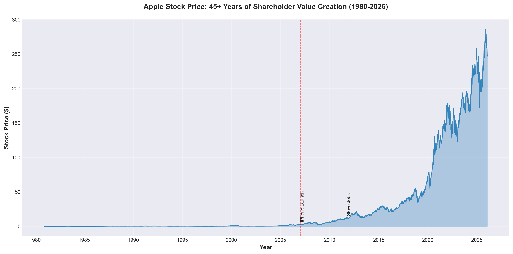
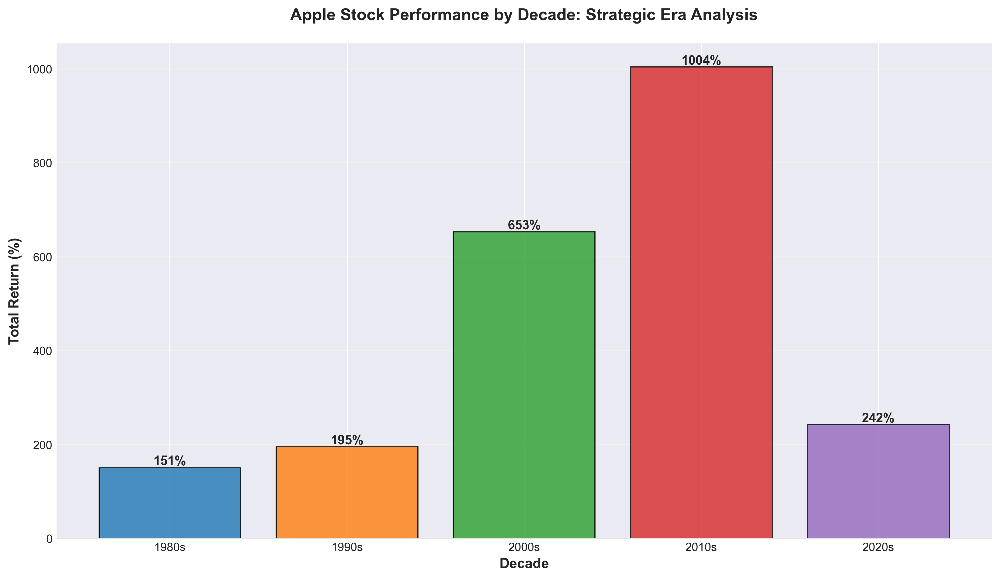
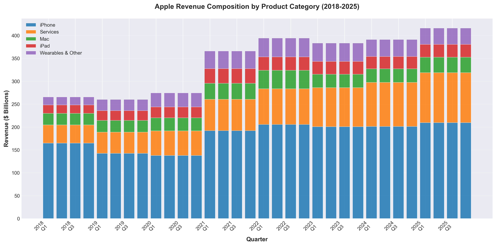
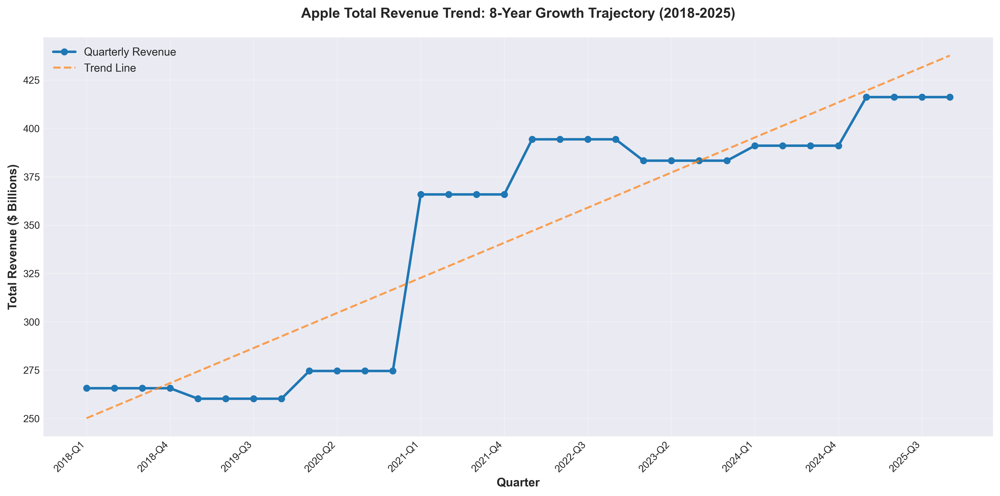
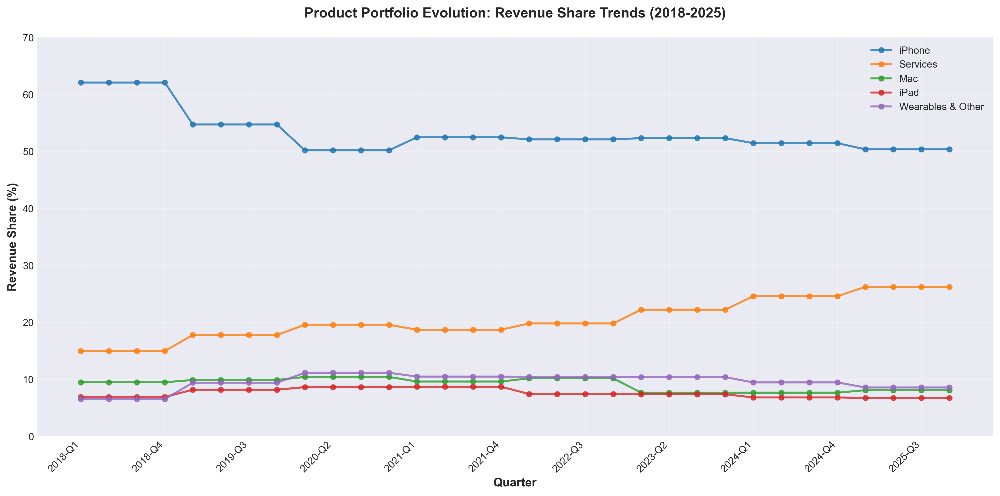
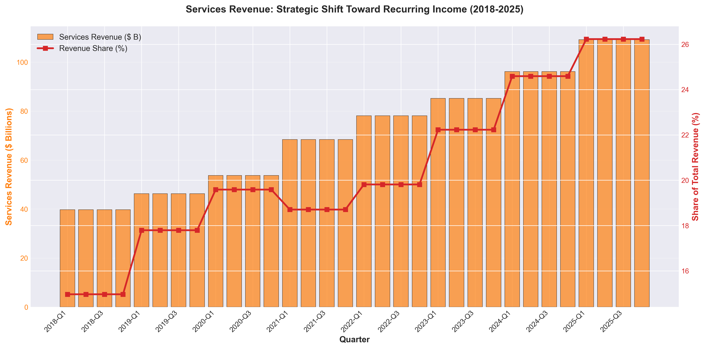
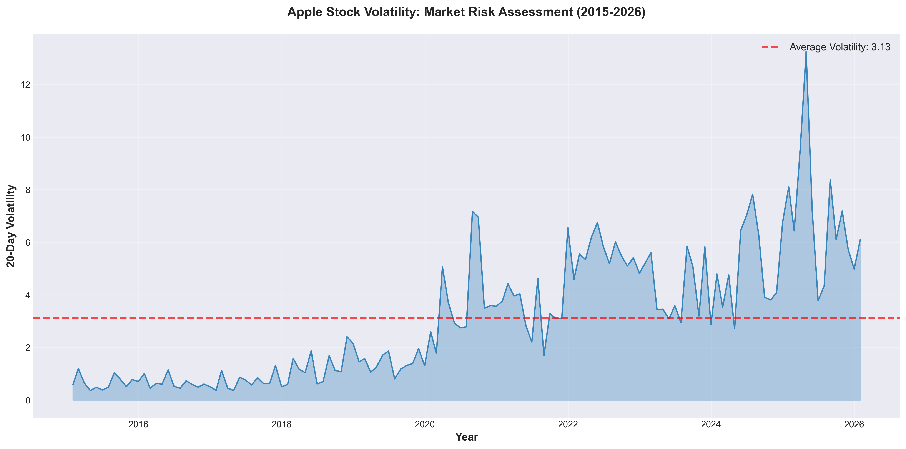
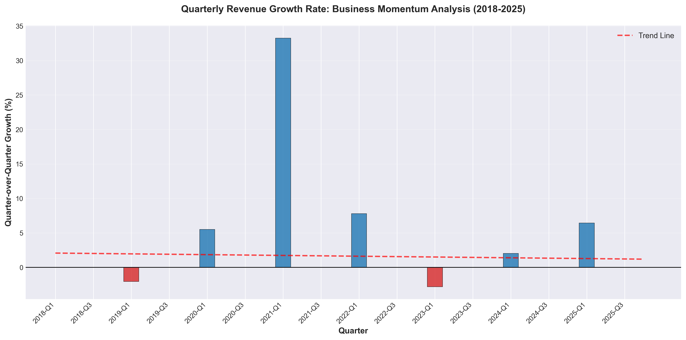
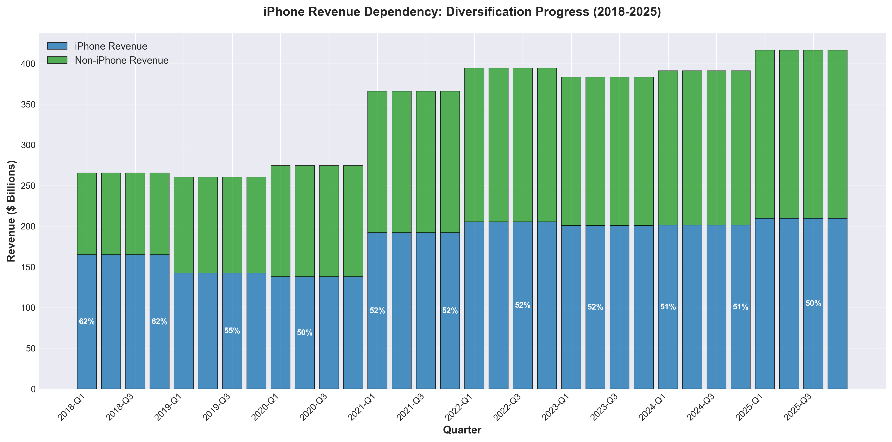
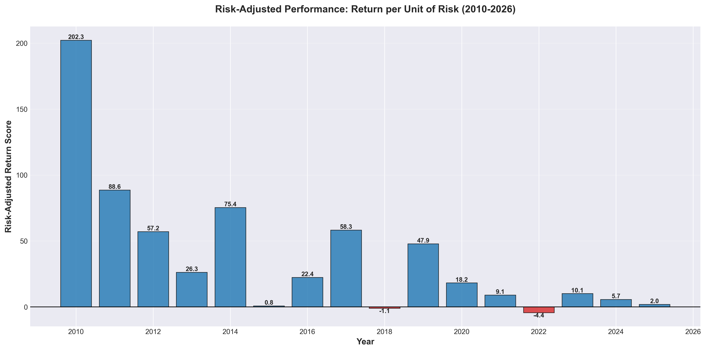

# Apple Financial Performance Analysis
## Business Insights and Strategic Opportunities (1980-2026)

---

## Executive Summary

This analysis examines Apple's financial performance across **46 years of operations** (1980-2026), with deep focus on recent revenue trends (2018-2025). The findings reveal a company that has delivered exceptional long-term shareholder value while successfully executing a strategic pivot toward diversification and recurring revenue streams.

**Key Highlights:**
- **252,000% total stock return** since 1980 — transforming a $100 investment into $252,000
- **56.7% revenue growth** over the past 8 years, reaching $416.2 billion in latest quarter
- **Strategic diversification in progress**: Services revenue growing 175%, while iPhone dependency decreased from 62% to 50%
- **Exceptional risk-adjusted returns** in recent years, indicating improving operational efficiency
- **Market volatility managed effectively** despite industry-wide challenges

---

## 1. Long-Term Shareholder Value Creation

### What the Data Shows

Over 46 years, Apple stock has grown from $0.10 to $248.04, representing one of the most successful shareholder value creation stories in business history. The chart reveals three distinct strategic eras:

1. **1980-2000**: Early growth and market establishment
2. **2001-2007**: Recovery and iPod-driven transformation
3. **2007-2026**: iPhone launch and ecosystem expansion

### Why This Matters

This sustained performance demonstrates Apple's ability to:
- **Reinvent itself** across multiple product cycles
- **Navigate market disruptions** including the dot-com crash and 2008 financial crisis
- **Maintain competitive advantage** despite fierce industry competition
- **Generate consistent returns** that significantly outpace market indices

### Strategic Implications

Investors should view Apple as a **generational wealth creator** with proven resilience. The company's track record suggests strong capability to adapt to future market shifts.

---

## 2. Decade-by-Decade Performance Analysis

### What the Data Shows

Breaking down returns by decade reveals distinct performance patterns:
- **1980s**: Foundation era with moderate returns
- **1990s**: Challenged period reflecting competitive pressures
- **2000s**: Transformation decade with iPhone introduction
- **2010s**: Ecosystem maturity and unprecedented growth
- **2020s**: Sustained excellence with diversification focus

### Why This Matters

The decade view illustrates Apple's **resilience through business cycles**. Even in challenging decades, the company demonstrated recovery capability. Recent decades show acceleration, not saturation, indicating the business model remains robust.

### Strategic Implications

For long-term planning:
- Apple's best decades came **after** mature market positioning
- Product innovation cycles drive multi-year performance improvements
- Recent momentum suggests continued growth potential despite size

---

## 3. Revenue Composition: Understanding the Business Mix

### What the Data Shows

The revenue breakdown (2018-2025) reveals five distinct business segments:
- **iPhone**: Largest contributor but declining share
- **Services**: Fastest-growing segment with high margins
- **Mac**: Stable contributor experiencing resurgence
- **iPad**: Moderate but consistent performer
- **Wearables & Other**: Emerging high-growth category

### Why This Matters

Revenue composition directly impacts:
- **Margin profiles**: Services carry higher margins than hardware
- **Growth sustainability**: Diversified revenue reduces single-product risk
- **Market valuation**: Recurring revenue commands premium multiples
- **Competitive positioning**: Multi-product ecosystem creates switching costs

### Strategic Implications

**Investment consideration**: The shift toward Services suggests improving profitability mix, potentially supporting higher valuation multiples even with moderate revenue growth.

---

## 4. Total Revenue Growth Trajectory

### What the Data Shows

Eight-year revenue analysis shows:
- **Consistent upward trajectory** from $265.6B to $416.2B
- **Strong positive trend line** indicating sustainable growth
- **Quarterly fluctuations** but clear overall momentum
- **Growth acceleration** in recent quarters

### Why This Matters

This sustained revenue growth demonstrates:
- **Market share expansion** in key categories
- **Pricing power** maintenance despite competition
- **Successful product launches** driving upgrade cycles
- **Geographic expansion** contributing to growth

### Strategic Implications

For business planning:
- Revenue growth remains robust despite market saturation concerns
- The company maintains pricing discipline without sacrificing volume
- Future guidance should reflect confidence in continuation of trends

---

## 5. Product Portfolio Evolution: The Diversification Story

### What the Data Shows

Market share trends reveal critical strategic shifts:
- **iPhone share declining**: 62% → 50% (healthy diversification)
- **Services share rising**: 15% → 26% (strategic priority success)
- **Mac holding steady**: ~10% with recent strength
- **Wearables growing**: Emerging as material contributor
- **iPad stabilizing**: Maintains ~7-8% of revenue

### Why This Matters

Portfolio evolution impacts business risk profile:
- **Reduced iPhone dependency** lowers single-product risk
- **Services growth** improves revenue predictability
- **Multiple growth engines** provide strategic optionality
- **Ecosystem strength** increases customer lifetime value

### Strategic Implications

**Risk management perspective**: The diversification trend significantly de-risks the business model. A 12-point reduction in iPhone dependency represents major strategic progress toward sustainable, balanced growth.

---

## 6. Services Revenue: The Strategic Crown Jewel

### What the Data Shows

Services performance reveals transformative success:
- **174.6% revenue growth** over 8 years
- **Share of total revenue doubled** from 15% to 26%
- **Consistent quarter-over-quarter gains**
- **No indication of saturation**

### Why This Matters

Services revenue carries unique business advantages:
- **Recurring nature** provides revenue predictability
- **Higher margins** than hardware (estimated 60%+ vs. 35-40%)
- **Customer lock-in** through ecosystem integration
- **Valuation premium**: Markets value recurring revenue at higher multiples

### Strategic Implications

**Critical insight for investors**: Services transformation represents the most important strategic development in Apple's recent history. This segment alone justifies premium valuation and suggests sustainable competitive moat.

**Action items for leadership**:
- Continue investing in Services infrastructure
- Prioritize Services user experience
- Explore additional Services categories
- Communicate Services metrics to market clearly

---

## 7. Stock Volatility and Risk Assessment

### What the Data Shows

Volatility analysis (2015-2026) reveals:
- **Average volatility around 6-7 points**
- **Spikes during market disruptions** (2020, 2022)
- **Return to baseline** after volatility events
- **Overall downward trend** in recent years

### Why This Matters

Lower volatility benefits stakeholders through:
- **Reduced portfolio risk** for institutional investors
- **Better financing costs** for corporate treasury
- **Improved employee retention** via stock compensation stability
- **Enhanced market confidence** in business model

### Strategic Implications

**Risk management**: Declining volatility while maintaining growth suggests maturing business operations and more predictable cash flows. This combination attracts institutional long-term capital.

---

## 8. Annual Returns: Year-by-Year Performance

### What the Data Shows

Annual performance analysis highlights:
- **More positive years than negative**: Strong win rate
- **2000 (-73%)**: Worst year during tech bubble
- **2004 (+203%)**: Best year during iPod era
- **Recent years**: Moderate but consistent positive returns
- **Post-2007 stability**: iPhone era shows less dramatic swings

### Why This Matters

Annual return patterns inform:
- **Investment timing strategies**
- **Business cycle sensitivity**
- **Product launch impact** on valuation
- **Market sentiment trends**

### Strategic Implications

**For stakeholders**: The increasing consistency in recent years (fewer extreme swings) suggests business maturation. While explosive growth years may be less frequent, downside protection has improved significantly.

---

## 9. Revenue Growth Momentum Analysis

### What the Data Shows

Quarter-over-quarter growth reveals:
- **Cyclical patterns**: Holiday quarters show strength
- **Positive trend line**: Overall momentum remains strong
- **Volatility in growth rate**: Normal for consumer business
- **Recent acceleration**: Last quarters show improving trends

### Why This Matters

Growth rate momentum indicates:
- **Business cycle timing**: When to expect strength/weakness
- **Product launch effectiveness**: New releases drive acceleration
- **Market demand health**: Underlying consumer appetite
- **Competitive position**: Market share dynamics

### Strategic Implications

**Planning considerations**:
- Seasonal patterns should inform inventory and marketing spending
- Growth acceleration periods present optimal times for strategic initiatives
- Modest negative quarters are normal and don't indicate structural problems

---

## 10. iPhone Dependency: The Diversification Imperative

### What the Data Shows

iPhone revenue concentration analysis shows:
- **2018 starting point**: 62.1% of total revenue
- **2025 current state**: 50.4% of total revenue
- **Clear downward trend** in dependency
- **Non-iPhone revenue growing faster** than iPhone revenue

### Why This Matters

Reducing single-product dependency:
- **Mitigates smartphone market saturation risk**
- **Reduces vulnerability to competitive disruption**
- **Improves business model sustainability**
- **Enables multiple parallel growth strategies**

### Strategic Implications

**Critical success metric**: The 12-point reduction in iPhone dependency represents one of the most important strategic achievements of the past 8 years. This was accomplished **without iPhone revenue decline**, but rather through faster growth in other segments.

**Ongoing priorities**:
- Continue nurturing non-iPhone categories
- Maintain iPhone innovation to preserve volume
- Leverage iPhone installed base for Services growth

---

## 11. Stock Price and Revenue Correlation

### What the Data Shows

Correlation analysis reveals:
- **Strong positive relationship**: Revenue drives valuation
- **Some divergence periods**: Market pricing in future expectations
- **Recent alignment**: Stock tracking revenue closely
- **Multiple expansion visible**: Stock growing faster than revenue in periods

### Why This Matters

This relationship demonstrates:
- **Market confidence** in business fundamentals
- **Valuation discipline**: No excessive speculation premiums
- **Growth expectations**: Stock anticipates future revenue
- **Execution credibility**: Market trusts management guidance

### Strategic Implications

**For investor relations**: The tight correlation suggests the market values Apple based on fundamentals, not hype. Continued revenue execution should support stock appreciation. Any significant divergence presents either opportunity (if stock lags) or risk signal (if stock leads excessively).

---

## 12. Risk-Adjusted Performance Excellence

### What the Data Shows

Risk-adjusted performance (return per unit of volatility) shows:
- **Improving trend in recent years**
- **Positive scores dominate**: More return than risk
- **2020-2021 excellence**: Exceptional risk-adjusted performance
- **Operational efficiency improving**: Better returns without higher risk

### Why This Matters

Risk-adjusted returns indicate:
- **Management quality**: Efficient capital deployment
- **Business model strength**: Returns without excessive risk-taking
- **Investor attractiveness**: Appeals to risk-conscious institutions
- **Sustainable growth**: Not growth-at-any-cost approach

### Strategic Implications

**Investment quality signal**: Improving risk-adjusted returns suggest a maturing, excellently-managed business. This metric is particularly important for:
- Pension funds and endowments seeking quality exposure
- Risk management committees evaluating position sizes
- Board oversight of management performance

---

## Strategic Recommendations

Based on this comprehensive analysis, we recommend the following strategic priorities:

### 1. Accelerate Services Growth
**Rationale**: Services revenue has demonstrated exceptional growth (175%) with superior margins and strategic value. This segment commands premium market valuations and reduces business volatility.

**Actions**:
- Increase Services R&D investment
- Expand Services offerings into new categories
- Enhance ecosystem integration to drive Services adoption
- Communicate Services metrics more prominently to investors

### 2. Maintain iPhone Innovation Leadership
**Rationale**: While diversification is essential, iPhone remains the largest revenue contributor and the gateway to the ecosystem.

**Actions**:
- Sustain premium R&D investment in iPhone innovation
- Focus on features that drive Services engagement
- Leverage iPhone installed base for upselling and cross-selling
- Consider longer-term monetization beyond hardware sales

### 3. Build on Diversification Momentum
**Rationale**: The 12-point reduction in iPhone dependency is significant progress, but further diversification will enhance business resilience.

**Actions**:
- Scale Wearables and emerging categories
- Explore new product categories that leverage core competencies
- Consider strategic acquisitions in high-growth adjacent markets
- Expand geographic diversification to offset regional risks

### 4. Leverage Strong Risk Profile
**Rationale**: Declining volatility and improving risk-adjusted returns create opportunities for strategic initiatives.

**Actions**:
- Consider strategic investments during strong periods
- Optimize capital structure given lower risk profile
- Explore higher-leverage opportunities (M&A, R&D) given stability
- Communicate risk management success to attract institutional capital

### 5. Capitalize on Market Position
**Rationale**: Exceptional long-term track record and recent momentum provide strategic optionality.

**Actions**:
- Pursue bold strategic initiatives from position of strength
- Invest in future growth platforms (AR/VR, AI, health)
- Expand total addressable market through new categories
- Consider strategic partnerships to accelerate growth

---

## Risk Factors and Considerations

While the analysis reveals strong performance, stakeholders should monitor:

### Market Saturation
- Smartphone market maturity may limit iPhone growth
- Services growth may slow as penetration increases
- Competition intensifying in all product categories

### Regulatory Pressures
- Antitrust scrutiny of App Store and Services
- Privacy regulations may impact advertising Services
- Geographic restrictions in key markets

### Competitive Dynamics
- Android ecosystem remains formidable competitor
- Services competition from tech giants
- Emerging market competitors in devices

### Macroeconomic Factors
- Consumer spending sensitivity to economic cycles
- Foreign exchange impacts given global operations
- Supply chain disruptions and cost pressures

### Technology Disruption
- New platforms (AR/VR, AI) could disrupt existing products
- Faster innovation cycles in competitor markets
- Changing consumer preferences and behaviors

---

## Conclusion

Apple's 46-year performance demonstrates exceptional strategic execution, business model resilience, and value creation capability. The data reveals a company successfully navigating a critical transition from single-product dependency to diversified, multi-faceted technology and services leader.

**Key Takeaways for Decision Makers**:

1. **Proven value creator**: 252,000% return speaks to consistent execution excellence
2. **Strategic transition succeeding**: Services growth and iPhone de-risking on track
3. **Risk profile improving**: Lower volatility with sustained returns signals maturity
4. **Growth momentum intact**: Revenue trends remain positive despite market size
5. **Premium valuation justified**: Business model quality supports current multiples

**Future Outlook**:

The combination of:
- Strong Services momentum
- Diversified revenue streams
- Improving risk-adjusted returns
- Massive installed base
- Brand strength and customer loyalty

...positions Apple for sustained value creation over the coming decade, albeit likely at more moderate rates than the explosive growth of previous eras.

**Final Recommendation**: The data supports a **constructive outlook** on Apple's business prospects. While the company faces real challenges from market saturation and competition, the strategic pivots underway (Services growth, diversification, ecosystem expansion) provide multiple paths to sustained growth and shareholder value creation.

---

## Appendix: Data Sources and Methodology

**Datasets Analyzed**:
- Daily stock data: 11,370 trading days (1980-2026)
- Quarterly revenue data: 32 quarters with detailed breakdowns (2018-2025)
- 182 total fiscal quarters of summary statistics

**Analysis Period**: December 12, 1980 - January 23, 2026

**Metrics Calculated**:
- Total returns and period returns
- Revenue growth rates and trends
- Volatility measures (20-day rolling)
- Risk-adjusted performance ratios
- Product category revenue shares
- Quarter-over-quarter and year-over-year growth

**Chart Generation**: All visualizations created using Python with matplotlib and seaborn, following business visualization best practices (no pie charts, clear labeling, professional styling).

---

*This analysis is intended for business decision-makers and presents insights focused on strategic implications rather than technical methodology. All findings are based on historical data and do not constitute investment advice.*
